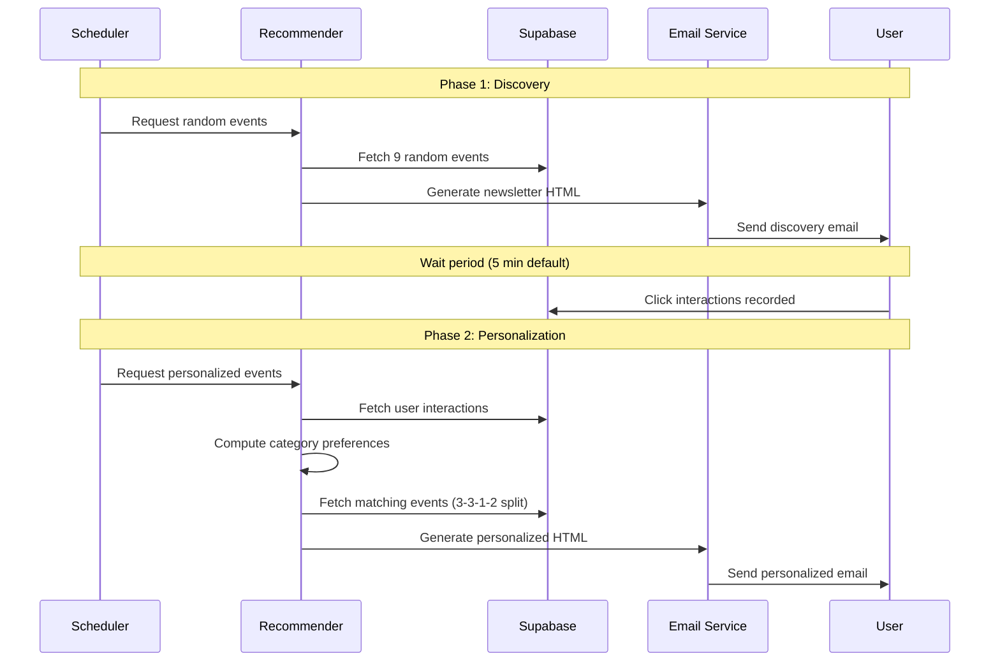
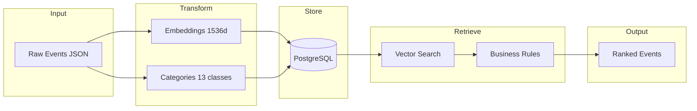
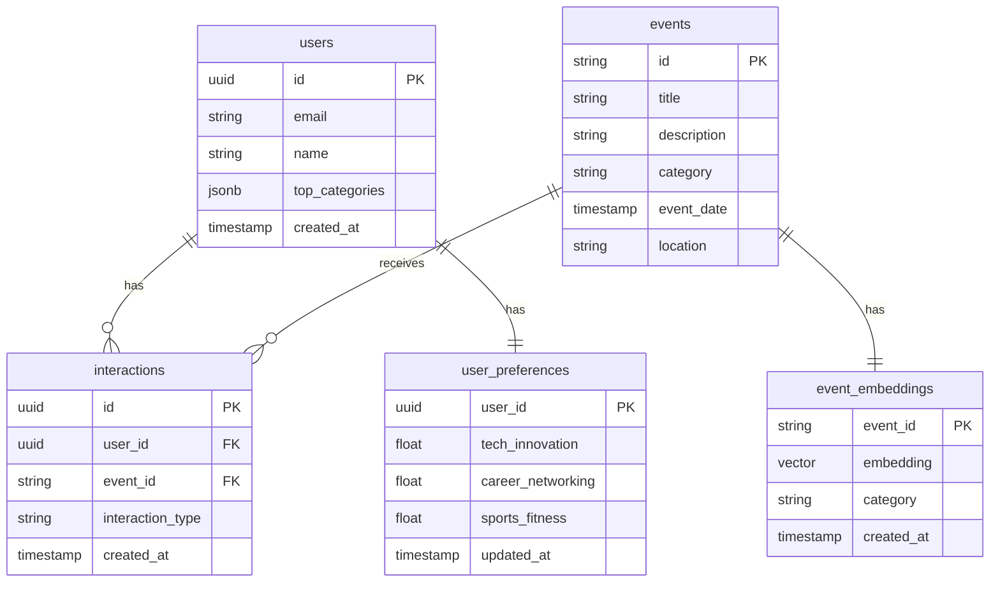

# Connect3 Newsletter - Architecture Documentation

## System Overview

The Connect3 Newsletter is a personalized event recommendation and delivery system, part of the broader Connect3 platform. It uses a two-tower recommendation architecture with semantic embeddings to deliver relevant university events to subscribers.

## Architecture Diagram

```mermaid
flowchart TB
    subgraph Data Sources
        IG[Instagram Scraper] --> JSON[(all_posts.json)]
        JSON --> EMBED[Embedding Pipeline]
    end

    subgraph Processing Layer
        EMBED --> |OpenAI API| EMB[(Event Embeddings)]
        CAT[Categorization] --> |GPT-4o-mini| EMB
    end

    subgraph Storage Layer
        EMB --> SUPA[(Supabase PostgreSQL)]
        SUPA --> EVENTS[events]
        SUPA --> USERS[users]
        SUPA --> INTER[interactions]
        SUPA --> PREFS[user_preferences]
    end

    subgraph Recommendation Engine
        EVENTS --> REC[Two-Tower Recommender]
        INTER --> SCORE[Scoring Engine]
        PREFS --> SCORE
        SCORE --> REC
        REC --> |Vector Similarity| MATCH[Candidate Matching]
    end

    subgraph Delivery Layer
        MATCH --> TEMPLATE[Email Templates]
        TEMPLATE --> SMTP[Gmail SMTP]
        SMTP --> USER[Subscriber Inbox]
    end

    subgraph Feedback Loop
        USER --> |Click Tracking| API[/api/feedback]
        API --> INTER
        API --> |Update| PREFS
    end
```

## Two-Phase Newsletter Flow



## Component Architecture

### Core Modules

| Module | Responsibility |
|--------|---------------|
| `recommender.py` | Two-tower recommendation with vector similarity |
| `vector_index.py` | NumPy-based cosine similarity search |
| `scoring.py` | Time-decayed preference scoring |
| `embeddings.py` | OpenAI embedding generation |
| `email_templates.py` | HTML email generation with tracking |
| `email_sender.py` | Gmail SMTP delivery with retry logic |

### Data Flow



## Metrics and Monitoring

### Logging Infrastructure

The system uses structured logging with timing context:

```python
from python_app.logger import get_logger, LogContext

logger = get_logger(__name__)

with LogContext(logger, "embedding generation"):
    # Operation is automatically timed
    embeddings = generate_embeddings(events)
# Output: "embedding generation completed in 1.23s"
```

### Key Metrics Tracked

| Metric | Location | Description |
|--------|----------|-------------|
| Email delivery time | `email_sender.py` | Time to send each newsletter |
| Embedding latency | `embeddings.py` | OpenAI API response time |
| Vector search time | `vector_index.py` | Similarity search duration |
| Interaction counts | `interactions` table | User engagement by type |
| Category distribution | `user_preferences` | Preference evolution |

### Click-Through Rate Calculation

```sql
-- CTR by newsletter phase
SELECT 
    DATE(created_at) as date,
    interaction_type,
    COUNT(*) as interactions,
    COUNT(DISTINCT user_id) as unique_users
FROM interactions
WHERE created_at > NOW() - INTERVAL '30 days'
GROUP BY DATE(created_at), interaction_type
ORDER BY date DESC;
```

### Preference Decay Monitoring

The scoring system uses exponential time decay with a 30-day half-life:

```
weight = e^(-λ × days_old)
where λ = ln(2) / 30
```

| Days Since Interaction | Weight |
|------------------------|--------|
| 0 (today) | 1.00 |
| 7 days | 0.85 |
| 15 days | 0.71 |
| 30 days | 0.50 |
| 60 days | 0.25 |
| 90 days | 0.12 |

## Performance Characteristics

### Benchmark Results

| Operation | Typical Latency | P95 Latency |
|-----------|-----------------|-------------|
| Embedding generation (per event) | 150-300ms | 500ms |
| Vector search (1000 events) | 5-15ms | 25ms |
| Category scoring | 2-5ms | 10ms |
| Email template generation | 10-30ms | 50ms |
| Full recommendation pipeline | 200-500ms | 1s |

### Throughput Estimates

| Metric | Capacity |
|--------|----------|
| Events in index | 10,000+ (NumPy) |
| Concurrent users | Limited by Supabase tier |
| Emails per minute | ~30 (Gmail limits) |
| API requests | 30/min/user (rate limited) |

### Scaling Considerations

1. **Vector Search**: Currently NumPy-based, can migrate to pgvector for larger datasets
2. **Email Delivery**: Batched with configurable delays to respect SMTP limits
3. **Database**: Connection pooling via Supabase client
4. **Rate Limiting**: In-memory sliding window, resets on cold start (acceptable for serverless)

## Security Measures

### Input Validation

- UUID format validation for user/event IDs
- Category allowlist (13 valid categories)
- Action type validation (like/dislike/click)
- HTML escaping for all user content in emails

### Rate Limiting

```python
RATE_LIMIT_WINDOW_SECONDS = 60
RATE_LIMIT_MAX_REQUESTS = 30
```

### Time Decay Policy

Clicks on newsletters older than 15 days do not update user preferences, preventing:
- Stale data from affecting recommendations
- Manipulation via old email links

## A/B Testing Framework

### Current Approach

The two-phase system inherently supports comparison:
- Phase 1 (random) serves as control
- Phase 2 (personalized) serves as treatment

### Metrics for Comparison

1. **Click-Through Rate**: Phase 2 CTR should exceed Phase 1
2. **Category Engagement**: Track which categories drive more clicks
3. **Time to Click**: Measure engagement velocity

### Extending A/B Testing

To add new experiments:

1. Add experiment flag to user record
2. Branch in `recommender.py` based on flag
3. Track experiment_id in interactions table
4. Analyze via SQL aggregations

## Database Schema



## Deployment Architecture

```mermaid
flowchart TB
    subgraph Vercel
        API[Serverless Functions]
        API --> FB[/api/feedback]
        API --> SUB[/api/subscribe]
        API --> UNSUB[/api/unsubscribe]
    end
    
    subgraph GitHub Actions
        CRON[Scheduled Trigger]
        CRON --> NEWSLETTER[Newsletter Pipeline]
    end
    
    subgraph External Services
        SUPA[(Supabase)]
        OPENAI[OpenAI API]
        GMAIL[Gmail SMTP]
    end
    
    FB --> SUPA
    NEWSLETTER --> SUPA
    NEWSLETTER --> OPENAI
    NEWSLETTER --> GMAIL
```
